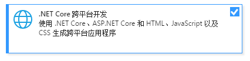

# 1-2 环境配置

本节介绍C#所用的开发与运行环境的配置。
在多种方式中，选择一种进行配置即可。

## 使用Visual Studio

操作系统：Windows

访问[Visual Studio下载](https://www.visualstudio.com/downloads/)可获取免费的Commmunity版。运行Visual Studio安装程序，即可对所需环境进行选择。Visual Studio会统一配置开发环境和运行环境。

在安装程序中，选择「.NET桌面开发」，便可创建面向.NET Framework的程序。

在安装程序中，选择「.NET Core跨平台开发」，便可创建面向.NET Core的程序。.NET Core程序在其它操作系统上可以直接运行。

## 使用Visual Studio Code

操作系统：Windows，Linux，macOS

Visual Studio Code需要分别配置开发环境和运行环境。

### 开发环境

访问[Visual Studio Code下载](https://code.visualstudio.com/)下载并安装。

打开Visual Studio Code，在扩展管理器中，选择C#并进行安装。

### 运行环境

打开[.NET Core下载中心](https://www.microsoft.com/net/download/core)，选择SDK进行下载。
