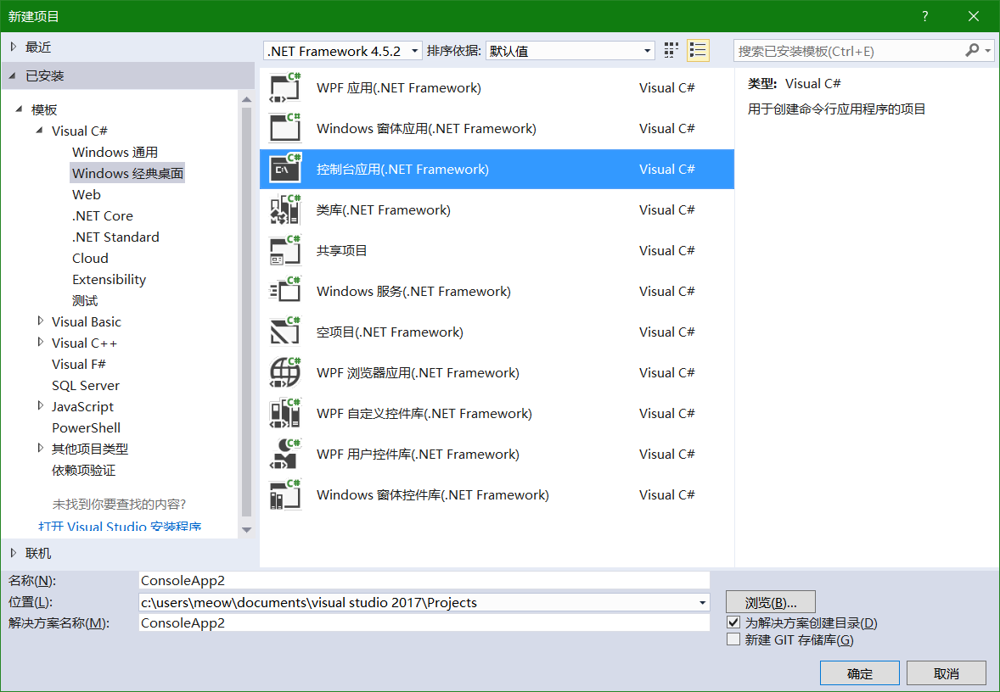
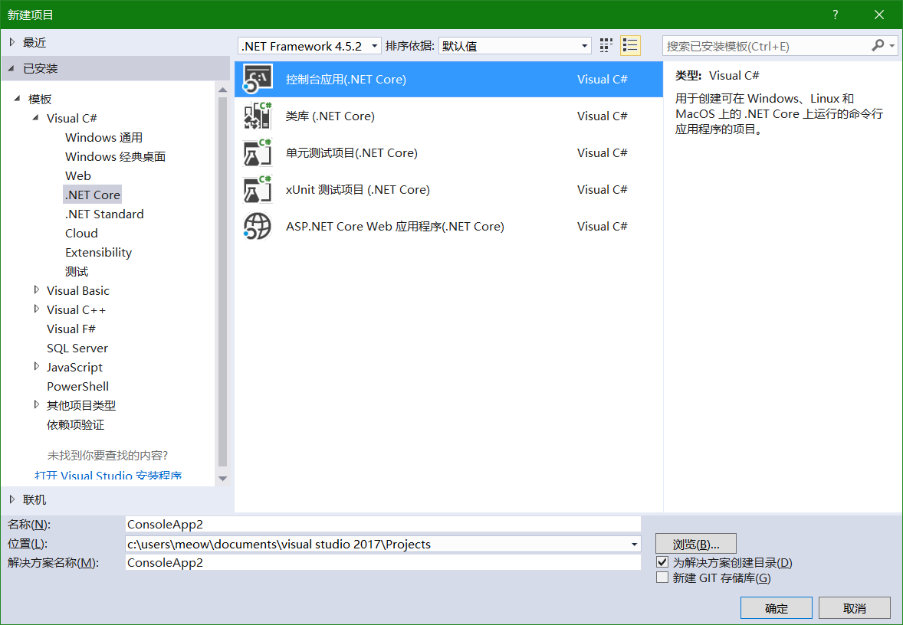

# 1-3 Hello world

本节介绍最基础的创建并运行程序的方法。

## 使用Visual Studio创建与运行项目

使用起始页，工具栏，或者「文件」菜单栏里的「新建项目」来建立一个新的项目。



选择C#->Windows经典桌面->控制台应用，便会创建一个在.NET Framework下运行的程序。



选择C#->.NET Core->控制台应用，便会创建一个在.NET Core下运行的程序。

在Visual Studio中按F5，或者工具栏上的「启动」，便可运行程序。

## 在其它开发环境中创建与运行项目（.NET Core）

新建/选择一个文件夹用来存放程序，然后开启命令行窗口并定位到该文件夹。

输入命令`dotnet new console`即可创建一个在.NET Core下运行的程序。

在该文件夹的右键菜单中选择「Open with Code」，即可在Visual Studio Code中打开该文件夹。（或在其它编辑器中打开文件/文件夹进行编辑）

在Visual Studio Code中按F5，或者左侧边栏的调试->开始调试，便可在Visual Studio Code中运行程序。

在命令行窗口中输入命令`dotnet run`，便可在命令行窗口中运行程序。

## 编辑源文件

打开新建项目中的`Program.cs`，可以看到类似如下的内容：

```csharp
using System;

namespace ConsoleApp1
{
    class Program
    {
        static void Main(string[] args)
        {
            //在此处输入代码
        }
    }
}
```

在Main之后的大括号对（`{}`）内输入的代码将会直接运行。在学习到更多内容之前，应将所有代码放置在此处。

## Hello world

将`//在此处输入代码`替换为：

```csharp
Console.WriteLine("Hello, world!");
```

即可获得编程语言中最广泛的示例：Hello world。

## 注释

**注释**为程序中说明性的文字，会在程序中被忽略。注释可以包含任何文本。

C#的注释格式来自C和C++：
- 由`//`开头的注释，称为行注释。从`//`开始一直到该行结尾都会被忽略。
- 由`/*`开头，`*/`结尾的注释，称为块注释。从开头符号到结尾符号中的任何内容都会被忽略。

> 注意：`/*`和`*/`并没有类似括号的数量匹配规则，而是简单的以遇到的第一个为准。因此，在`/*`的前方增加`/*`可以延长块注释的开头，但在`*/`的后方增加`*/`并不能延长注释块的结尾。
